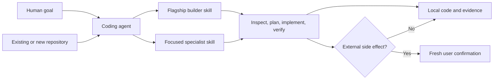

<!-- markdownlint-disable MD013 -->

# iOS/Android Mobile App Builder

[](https://skills.sh/khadinakbarlabs/expo-mobile-app-builder)
[](https://github.com/khadinakbarlabs/expo-mobile-app-builder/actions/workflows/validate.yml)
[](LICENSE)
[](https://docs.expo.dev/versions/v54.0.0/)
[](#iosandroid-parity-by-default)
[](#the-skill-library)

**Turn a mobile app idea, an existing Expo repository, or a release blocker into a clear plan and a verified iOS and Android implementation.**

iOS/Android Mobile App Builder is a public, open-source plugin for building mobile products with [Expo](https://expo.dev/) and [React Native](https://reactnative.dev/). It covers the path from product research and planning through UI/UX, architecture, development, native platform work, testing, EAS, store submission, review response, and approval follow-through. The same skill library is packaged for ChatGPT and Codex's universal plugin format, direct Codex and Claude Code repository marketplaces, Cursor, and portable Agent Skills-compatible hosts.

It is not a hosted no-code service and it does not hide your project behind a proprietary editor. The package is a portable library of **165 focused Agent Skills** that work with your files, your repository, and your chosen coding agent. Start with one flagship skill for complete app-building work, or install the full catalog and let the agent load only the workflow relevant to the task.

**Credential-free by design.** This repository contains no Expo access token, Apple signing key, Android keystore, Play service-account file, API key, private account identifier, hosted backend, telemetry collector, or remote executor. Local implementation may edit your app when you ask it to. Builds, uploads, submissions, publication, pricing changes, and paid actions stay behind explicit user authorization.

**Independent community project.** This project is not affiliated with or endorsed by Expo, Apple, Google, React Native, EAS, Anthropic, Cursor, or OpenAI.

## At a glance

| | |
| --- | --- |
| **Best for** | Founders, product teams, mobile developers, agencies, and coding agents building Expo apps |
| **Platforms** | iOS and Android, with platform parity treated as a first-class requirement |
| **Mobile stack** | Expo SDK 54 and React Native, with Expo Router and TypeScript used when they fit the project |
| **Coverage** | Research and validation through implementation, QA, EAS, submission, review response, and approval follow-through |
| **Library** | 165 narrowly triggered, independently installable Agent Skills |
| **Default entry point** | `mobile-app-builder-ios-android` |
| **Configuration** | None required for the plugin itself; optional project guidance improves repeatability |
| **Runtime** | Static Markdown guidance plus small credential-free local planning and validation scripts |
| **Data model** | No plugin account, cloud database, analytics endpoint, or background data collection |
| **License** | MIT |

## Choose your path

You do not need to understand the plugin format before using it.

| If you are... | Start here | What happens next |
| --- | --- | --- |
| **A founder or product owner** | [Human quickstart](#human-quickstart) | Describe the user, problem, and first release; the agent turns that into scope, screens, risks, and an implementation sequence |
| **A developer with an existing Expo app** | [Existing-project prompt](#2-adopt-or-audit-an-existing-expo-app) | The agent inspects the repository, identifies the current architecture, and proposes the smallest safe change |
| **An AI coding agent** | [Agent operating contract](#agent-operating-contract) | Follow an explicit discovery, planning, implementation, verification, and handoff protocol |
| **A team lead** | [Project configuration](#optional-project-configuration) | Add durable repository rules for Expo versioning, platform parity, credentials, tests, and release gates |
| **Preparing a release** | [Release-readiness workflow](#9-prepare-an-ios-and-android-release) | Separate local evidence from provider-side actions and keep upload or submission steps confirmation-gated |
| **Looking for one specific capability** | [Skill routing guide](#skill-routing-guide) | Select a focused skill for auth, notifications, subscriptions, accessibility, native features, ASO, or another task |

## Table of contents

- [Quick install](#quick-install)
- [Human quickstart](#human-quickstart)
- [Why this exists](#why-this-exists)
- [How the plugin works](#how-the-plugin-works)
- [What you can build](#what-you-can-build)
- [The mobile product lifecycle](#the-mobile-product-lifecycle)
- [Using it as a human](#using-it-as-a-human)
- [Using it as an AI agent](#using-it-as-an-ai-agent)
- [Optional project configuration](#optional-project-configuration)
- [Prompt cookbook](#prompt-cookbook)
- [Skill routing guide](#skill-routing-guide)
- [From planning and research to store approval](#from-planning-and-research-to-store-approval)
- [The skill library](#the-skill-library)
- [iOS/Android parity by default](#iosandroid-parity-by-default)
- [Production-ready means evidence, not a promise](#production-ready-means-evidence-not-a-promise)
- [Safety, privacy, and permission boundaries](#safety-privacy-and-permission-boundaries)
- [Repository architecture](#repository-architecture)
- [Validation](#validation)
- [Updating and uninstalling](#updating-and-uninstalling)
- [Troubleshooting](#troubleshooting)
- [FAQ](#faq)
- [Contributing](#contributing)
- [Distribution status](#distribution-status)
- [Policies and support](#policies-and-support)

## Quick install

The fastest path is to install the flagship skill. It covers the complete iOS and Android workflow while keeping the agent's context focused.

```bash
npx skills add khadinakbarlabs/expo-mobile-app-builder \
  --skill mobile-app-builder-ios-android \
  --agent codex \
  --copy \
  --yes
```

Replace `codex` with `claude-code`, `cursor`, or another profile supported by your installed Skills CLI. Then open your mobile app repository in that agent and use a direct prompt:

```text
Use iOS/Android Mobile App Builder to inspect this repository and build the
smallest complete version of [feature]. Preserve iOS and Android parity,
include loading/empty/error/offline states where relevant, validate the result,
and stop before any build, upload, submission, publication, or paid action.
```

To browse before installing:

```bash
npx skills add khadinakbarlabs/expo-mobile-app-builder --list
```

To install all 165 skills:

```bash
npx skills add khadinakbarlabs/expo-mobile-app-builder \
  --skill '*' \
  --agent codex \
  --copy \
  --yes
```

The flagship skill is also available on [skills.sh](https://skills.sh/khadinakbarlabs/expo-mobile-app-builder/mobile-app-builder-ios-android).

### Native Codex installation

```bash
codex plugin marketplace add khadinakbarlabs/expo-mobile-app-builder
codex plugin add expo-mobile-app-builder@expo-mobile-app-builder
```

If your Codex build does not support repository marketplaces, use the Skills CLI route above with `--agent codex`.

### Native Claude Code installation

Run these commands inside Claude Code:

```text
/plugin marketplace add khadinakbarlabs/expo-mobile-app-builder
/plugin install expo-mobile-app-builder@expo-mobile-app-builder
```

The GitHub marketplace route is independent of any approval in a platform-operated directory.

### Cursor installation

Install the portable skills into Cursor:

```bash
npx skills add khadinakbarlabs/expo-mobile-app-builder \
  --skill '*' \
  --agent cursor \
  --copy \
  --yes
```

The repository also includes a native Cursor manifest for directory packaging. A manifest does not by itself mean that an official marketplace listing has been reviewed or approved.

### ChatGPT and the universal Plugins Directory

The package includes an OpenAI plugin manifest with the public display name **iOS/Android Mobile App Builder**. The name is exactly 30 characters so it fits a 30-character listing limit while retaining the two highest-intent platform terms.

After an official listing is reviewed and published, users can search that directory by the public name. Until then, GitHub, skills.sh, Codex CLI, Claude Code, Cursor, and portable Agent Skills installation remain separate routes. See [distribution status](#distribution-status) for the honest current boundary.

### Clone and inspect the source

```bash
git clone https://github.com/khadinakbarlabs/expo-mobile-app-builder.git
cd expo-mobile-app-builder
node scripts/validate-release.mjs
node scripts/audit-public-package.mjs .
```

Cloning is useful when you want to audit the package, contribute a skill, pin a Git revision, or inspect every instruction before installation.

## Human quickstart

This route is for people who want an app outcome, not a lesson in plugin internals.

### 1. Install one skill

Install `mobile-app-builder-ios-android` using the quick-install command above. Starting with one skill keeps the setup simple. You can add the specialist catalog later.

### 2. Open the right folder

Open either:

- an existing Expo or React Native repository; or
- an empty parent folder where you want the agent to plan a new project.

For an existing app, the repository should contain the actual source and configuration the agent needs to inspect. For a new app, the agent should plan first and explain the proposed stack before scaffolding.

### 3. Describe the outcome in ordinary language

You can be concise:

```text
I want an iOS and Android habit app for people who struggle to stay consistent.
The first release needs email login, three daily habits, reminders, streaks,
offline use, and a simple subscription. Help me define the smallest useful MVP,
then build one complete vertical slice. Do not start external builds or store work.
```

A useful prompt usually contains four things:

1. **Who it is for** — the person or team with the problem.
2. **What outcome matters** — the job the app helps them complete.
3. **What must exist in the first release** — the smallest set of capabilities.
4. **What is out of bounds** — for example, no store submission, no paid services, or plan-only mode.

If you do not know the architecture, package choices, screen states, native constraints, or testing strategy, do not invent them. That is what the builder is for.

### 4. Review the plan before implementation

A strong first response should make the work visible. Expect a compact product scope, a screen map, a data-flow explanation, an iOS/Android parity matrix, likely dependencies, risks, a verification plan, and a clear list of external actions that remain unapproved.

Ask questions if the plan silently assumes a backend, authentication provider, subscription model, data collection practice, or native capability you did not request. You should be able to understand the product boundary before code changes begin.

### 5. Build one vertical slice

Do not ask for the entire app in one undifferentiated pass. A vertical slice is a real user journey that reaches from interface to state and data, including its failure states. For the habit example, a useful first slice might be:

```text
Create a habit -> see it on Today -> mark it complete -> persist the result ->
restart the app -> confirm the result remains -> test the same flow on iOS and Android.
```

That slice produces evidence and exposes architecture problems early. Once it works, repeat the pattern for reminders, account sync, subscriptions, and other capabilities.

### 6. Ask for evidence, not confidence

“Done” should tell you what changed and how it was checked. Source inspection, linting, type checks, unit tests, simulator runs, emulator runs, physical-device checks, EAS builds, and provider-dashboard observations are different kinds of evidence. The agent should not blur them together.

An honest handoff sounds like this:

```text
Implemented and type-checked locally. The iOS simulator flow was exercised.
Android source parity was reviewed, but no Android emulator was available in
this environment. No EAS build, store upload, or provider configuration changed.
```

That is more useful than an unsupported “production-ready” claim.

## Why this exists

Building a mobile app rarely fails because nobody can generate a screen. It fails in the seams: the idea was never reduced to a useful first release; the backend was chosen before the data needs were understood; the happy path works but permission denial does not; iOS received all the runtime testing; the privacy form disagrees with the SDKs in the binary; or “ship it” quietly mixed local code changes with a production submission.

This plugin turns those seams into an explicit workflow.

| Without a connected workflow | With iOS/Android Mobile App Builder |
| --- | --- |
| Research lives in a document that development never reads | Research produces product constraints, scope, and risks that shape the implementation |
| A large prompt creates many screens but no complete journey | The agent builds the smallest vertical slice through UI, state, data, errors, and persistence |
| Shared code is mistaken for platform parity | iOS and Android behavior and evidence are reported separately |
| Provider setup starts before privacy and ownership are clear | Data, account, secret, and provider boundaries are decided before configuration |
| “Production-ready” means the code compiled once | Readiness is a visible record of checks, runtime evidence, limitations, and unperformed actions |
| Store submission is treated as the last command in a script | Store work is a gated sequence: prepare, build, upload, submit, respond, approve, and roll out |

The result is not less human involvement. It is better human control. Founders can describe outcomes without guessing the implementation. Developers can invoke one narrow workflow without loading an entire mobile handbook. Agents know what authority they have, what evidence to collect, and where to stop.

## How the plugin works

The plugin is a **skill library**, not a second application runtime.



Each skill is a small instruction package with a precise trigger and workflow. When the task is broad—“build my mobile app”—the agent uses the flagship skill. When the task is specific—“add Expo notifications,” “audit TalkBack,” or “prepare a controlled TestFlight upload”—the matching specialist skill provides a narrower playbook.

The package does not send your repository to a plugin-owned server. It does not provide a remote build queue, inject an analytics SDK, create an account, or obtain provider credentials. Your chosen coding-agent host controls model execution and repository access according to its own settings. The plugin contributes domain guidance and local, inspectable scripts.

### Why 165 focused skills instead of one enormous prompt?

Mobile product work spans several disciplines:

- product discovery and market validation;
- cross-platform React Native architecture;
- Expo SDK compatibility;
- Apple-specific behavior and review preparation;
- Android-specific behavior and Play preparation;
- accessibility, privacy, security, and quality assurance;
- subscriptions, analytics, notifications, and backend integration;
- store assets, ASO, launch planning, and staged release operations.

Loading every detail for every task wastes context and makes it harder for an agent to distinguish a relevant rule from background information. Focused skills let the host retrieve the smallest useful operating guide. The flagship skill coordinates the lifecycle; the specialist skills provide depth at the moment it is needed.

### What the agent is expected to do

For an implementation task, the default behavior is:

1. inspect the live repository and its local instructions;
2. clarify only decisions that materially change the product or architecture;
3. consult the exact Expo SDK 54 documentation relevant to the capability;
4. produce a small plan with explicit platform and state coverage;
5. implement the smallest complete vertical slice;
6. run checks proportional to the risk;
7. distinguish observed evidence from assumptions;
8. report changes, validation, parity, and remaining external actions.

For a planning or audit task, the agent should remain read-only unless the user separately asks for implementation.

## What you can build

The package is intentionally product-shaped rather than template-shaped. It can guide the construction of many Expo and React Native applications, including:

- consumer subscription apps with onboarding, paywalls, account management, and retention loops;
- offline-first utilities using local storage, SQLite, query caching, and later synchronization;
- camera, barcode, image, notification, deep-link, and haptic experiences;
- AI-assisted mobile products with explicit disclosure, consent, moderation, and safe streaming patterns;
- content, wellness, education, productivity, creator, community, commerce, and internal business apps;
- apps with platform extensions such as widgets, Live Activities, App Clips, watch apps, Wear OS, Android widgets, Picture-in-Picture, quick actions, or foldable layouts;
- existing apps that need an architecture audit, dependency upgrade plan, performance pass, accessibility review, release-readiness review, or targeted bug fix;
- App Store and Google Play launch packages where code, metadata, privacy declarations, screenshots, testing, and rollout planning must agree.

What changes from project to project is the product requirement. The workflow remains consistent: scope the outcome, identify constraints, choose the smallest architecture that satisfies them, implement complete states, verify both platforms, and separate local readiness from provider-side release actions.

### What this project is not

It is not:

- a visual drag-and-drop app builder;
- a hosted backend or database;
- a replacement for Expo, React Native, Xcode, Android Studio, EAS, App Store Connect, or Play Console;
- an automatic app-submission robot;
- a source of Apple, Google, Expo, RevenueCat, Firebase, Supabase, or other credentials;
- a guarantee of legal compliance, marketplace acceptance, ranking, conversion, or revenue;
- an excuse to skip device testing, accessibility work, privacy review, or provider documentation.

Those boundaries are deliberate. They keep the plugin inspectable, portable, and useful inside the development workflow you already control.

## The mobile product lifecycle

The flagship builder treats a mobile app as a connected lifecycle. A decision made during discovery can affect architecture, onboarding, data collection, store declarations, and release risk months later. The workflow keeps those relationships visible.

| Stage | Core question | Typical output | Representative skills |
| --- | --- | --- | --- |
| **1. Discover** | Is there a real problem and a reachable user? | Pain evidence, alternatives, niche and competitor map | `find-niche`, `market-validation`, `mine-competitor-reviews`, `mine-reddit-pain-points` |
| **2. Define** | What is the smallest useful release? | Target user, job-to-be-done, scope, non-goals, success signal | `jtbd-interview`, `mom-test`, `interview-users`, `position-pitch` |
| **3. Architect** | What is the least complex system that meets the requirement? | Navigation, state, data, backend, storage, security, parity plan | `choose-backend`, `choose-storage`, `set-up-project-guidance`, `command-scaffold-app` |
| **4. Design** | How does the user reach value in every state? | Screen map, tokens, onboarding, happy/empty/loading/error states | `figma-to-rn`, `design-onboarding-quiz`, `apply-hig`, `apply-material3` |
| **5. Build** | Can one complete user journey work end to end? | Typed screens, state, data flow, accessible interactions | `mobile-app-builder-ios-android`, `add-zustand`, `add-tanstack-query`, `add-reanimated` |
| **6. Integrate** | Which native and third-party capabilities are justified? | Auth, notifications, deep links, analytics, subscriptions, extensions | `add-supabase-auth`, `add-expo-notifications`, `add-deep-links`, `integrate-revenuecat-rn` |
| **7. Verify** | What evidence shows the behavior works and fails safely? | Lint/type/test results, simulator/device evidence, accessibility findings | `command-audit-rn`, `accessibility-audit`, `e2e-checklist`, `add-sentry-rn` |
| **8. Prepare** | Are code, configuration, privacy claims, and listing assets aligned? | EAS profiles, policy checklist, privacy and store metadata | `eas-build-profiles`, `generate-privacy-policy`, `data-safety-form`, `pre-submission-audit` |
| **9. Release** | What provider-side action is authorized, observable, and reversible? | Controlled upload or rollout plan with explicit target and gate | `eas-submit-testflight`, `eas-submit-play`, `phased-release`, `phased-release-play` |
| **10. Learn** | What should improve after real usage? | Diagnostics, listing experiments, retention and launch learnings | `add-posthog-rn`, `play-listing-experiments`, `custom-product-pages`, `plan-launch` |

You can enter the lifecycle anywhere. An existing app may start at Verify. A founder may start at Discover. A mature team may install only the release and platform-specialist skills. The stages are a map, not bureaucracy.

## Using it as a human

The plugin is designed to accept product language and translate it into engineering work without pretending that every decision is purely technical.

### You can start incomplete

These are valid starting points:

```text
I have an app idea but I do not know whether it needs a backend.
```

```text
This screen feels slow and the Android layout breaks on smaller devices.
```

```text
We have an Expo app in production. I want to add subscriptions without changing
our existing authentication or analytics stack.
```

```text
I need a release-readiness audit, not code changes.
```

The agent should inspect what exists, state what it knows, identify the decisions that matter, and avoid forcing you to specify implementation details you hired the workflow to determine.

### Pick an operating mode

State the mode at the beginning of the task when the boundary matters.

| Mode | Use it when | Expected behavior |
| --- | --- | --- |
| **Plan only** | You are evaluating an idea or architecture | Inspect and recommend; make no source changes |
| **Implement** | The outcome and repository are clear | Plan briefly, edit the scoped files, and verify the result |
| **Audit** | You need findings before deciding what to change | Remain read-only and rank findings by impact and evidence |
| **Debug** | A build or user flow is failing | Reproduce or inspect, isolate cause, and fix only if requested |
| **Release preparation** | Local product work is complete | Validate configuration and assets; do not upload or submit |
| **Release operation** | You explicitly want a provider-side action | Reconfirm account, app, platform, artifact, track, and consequence before acting |

You can combine modes deliberately. For example: “Audit first. If there are no high-risk findings, implement the top two accessibility fixes. Do not touch release configuration.”

### Give constraints, not secrets

Useful constraints include:

- “The app must work offline for the primary flow.”
- “We already use Supabase auth and do not want to migrate.”
- “The minimum supported devices are defined in the existing project.”
- “No native module unless Expo Go cannot satisfy the requirement.”
- “The first release is English-only, but strings must be localization-ready.”
- “Do not add analytics in this task.”
- “Keep the free flow usable without creating an account.”

Do not paste live access tokens, signing certificates, keystores, service-account JSON, payment details, recovery codes, or private customer data into the prompt. The agent can plan secret names, provider-side steps, and ownership boundaries using placeholders. When a real value is required, use the secret mechanism provided by the relevant host or provider.

### Ask the agent to expose tradeoffs

Mobile architecture often has more than one reasonable path. Ask for a recommendation plus the decision rule:

```text
Compare local-only storage, Supabase, and a small custom API for this app.
Recommend one based on offline behavior, account sync, deletion requirements,
operational cost, and how difficult it will be to change later.
```

This produces a decision you can evaluate, not a package list detached from product needs.

### Use acceptance criteria

Acceptance criteria turn a vague feature into observable behavior:

```text
The reminder feature is complete when:
- a user can choose a local time and weekdays;
- denied permission has an understandable recovery path;
- the schedule survives an app restart;
- tapping a notification opens the correct screen;
- VoiceOver and TalkBack labels are meaningful;
- the flow is checked on iOS and Android;
- no remote notification credential is required for the local-only version.
```

The agent can refine these criteria before implementation. You retain control over the definition of done.

### Review the handoff

At the end of a substantial task, look for seven things:

1. **Outcome** — what user-visible behavior now exists.
2. **Files** — what changed and why.
3. **Architecture** — any new dependency, state, data, or native boundary.
4. **Parity** — what was shared, what differed, and why.
5. **Evidence** — commands and observed surfaces, not just assertions.
6. **Limitations** — anything not tested or still assumed.
7. **External actions** — builds, uploads, provider settings, and submissions that remain untouched.

If one of those is missing, ask for it. A good mobile-app handoff should let another human or agent continue without reconstructing the entire session.

## Using it as an AI agent

The plugin is equally usable by agents that discover skills automatically and by agents that are explicitly told which skill to load.

### Agent operating contract

When the broad builder skill is active, use this sequence:

#### 1. Establish authority and mode

Determine whether the user asked for an answer, plan, audit, diagnosis, implementation, release preparation, or external release operation. Do not treat a request to inspect or plan as permission to edit. Do not treat a request to prepare a release as permission to build, upload, submit, publish, change pricing, or spend money.

#### 2. Inspect before proposing

For an existing project, read the repository instructions, package manifest, Expo configuration, routing, state and data layers, tests, native directories when present, and relevant local changes. Preserve unrelated work. Prefer the project’s established patterns unless the requested outcome exposes a clear reason to change them.

For a new project, identify the target user, core outcome, smallest useful scope, account and data needs, offline behavior, monetization, platform-specific capabilities, and release constraints before scaffolding.

#### 3. Verify versioned guidance

Expo changes over time. Before writing version-sensitive code, consult the exact [Expo SDK 54 documentation](https://docs.expo.dev/versions/v54.0.0/) for the requested capability. For Apple, Google, privacy, billing, or store-policy work, verify current first-party documentation rather than relying on remembered policy details.

#### 4. Plan the smallest complete slice

Cover navigation, state, data, security, accessibility, loading, empty, error, and offline behavior as relevant. Include an iOS/Android parity matrix. Prefer a vertical slice that can be exercised over a large set of disconnected scaffolds.

#### 5. Implement with platform intent

Use TypeScript and Expo-compatible dependency installation where appropriate. Keep shared behavior shared, but do not erase legitimate platform conventions. Add native code only when the requirement justifies its maintenance cost. Never hard-code credentials or request that a user paste secrets into source.

#### 6. Verify proportionally

Run the repository’s lint, type, test, and focused verification commands. Exercise the changed user journey on available simulators, emulators, or devices. Do not describe source review as runtime testing. Do not describe a local build as provider acceptance. If a surface is unavailable, state the gap.

#### 7. Hand off in a stable format

Return:

```text
Outcome
Scope and non-goals
Architecture and data flow
Files changed
iOS/Android parity notes
Validation evidence
Known limitations
External actions not performed
Recommended next step
```

This structure is intentionally useful to both a human reviewer and a future agent session.

### Agent decision rules

Use these rules when the prompt is underspecified:

- If a safe assumption changes only implementation detail and follows the existing repository, make it and state it.
- If an assumption changes the product, data model, provider, billing, privacy posture, or release path, ask or present options before committing.
- If the user asks for a broad build, start with the flagship skill and route to specialists only when a concrete capability appears.
- If the user names a skill, follow that skill and keep the rest of the catalog out of context unless needed.
- If a dependency is Expo-managed, prefer `npx expo install` so the installed version remains compatible with the target SDK.
- If a task can stay within Expo's managed model, do not introduce native maintenance merely because it is possible.
- If the requirement needs native configuration or a development build, explain why Expo Go is insufficient.
- If only one platform can be exercised, inspect parity but label the unobserved platform honestly.
- If a provider action can create cost, exposure, irreversible state, or external communication, pause for a fresh confirmation with the exact target.
- If current policy matters, browse first-party documentation and distinguish sourced facts from recommendations.

### Expected agent outputs by task type

| Task | Minimum useful output |
| --- | --- |
| **Idea to plan** | User, problem, evidence needs, MVP, non-goals, screen map, architecture options, risk register, milestones |
| **New scaffold** | Chosen stack, generated structure, first vertical slice, local run instructions, checks, no external build |
| **Feature** | Acceptance criteria, affected flow, implementation, state/error coverage, parity notes, focused tests |
| **Audit** | Evidence-backed findings with severity, user impact, file references, remediation path, and coverage limits |
| **Bug diagnosis** | Reproduction or observed symptom, root cause, competing hypotheses ruled out, fix status, regression check |
| **Performance work** | Baseline, bottleneck evidence, change, post-change measurement, device/build conditions |
| **Release preparation** | Version/config review, artifact prerequisites, privacy/listing alignment, QA status, remaining account actions |
| **External release operation** | Confirmed app/account/platform/artifact/track, executed action, live provider evidence, rollback or next gate |

### Agent-safe kickoff prompt

Repository owners can paste this into almost any compatible coding agent:

```text
Use the installed iOS/Android Mobile App Builder skills for this repository.

Operating mode: [plan only / implement / audit / debug / release preparation]
Goal: [user-visible outcome]
Target users: [audience]
Required platforms: iOS and Android
Constraints: [offline, provider, deadline, existing architecture, non-goals]

Inspect the repository before proposing changes. Use Expo SDK 54 documentation
for version-sensitive guidance. Preserve unrelated work. Cover accessibility,
loading, empty, error, and offline behavior where relevant. Report evidence for
each platform separately. Never request or expose credentials. Stop before any
build, upload, submission, publication, pricing, or paid action unless I give a
fresh, explicit authorization for the exact target.
```

### Why this format helps agents

Agents perform better when authority, outcome, constraints, and proof are separate. The prompt above prevents several common failures:

- treating “help me ship” as blanket permission for external actions;
- writing code against a remembered Expo version;
- optimizing only the iOS simulator path while assuming Android parity;
- implementing the happy path and postponing failure states indefinitely;
- adding a backend, analytics service, or subscription provider without a product decision;
- reporting success from source changes without runtime or provider evidence;
- asking users to paste sensitive values into chat or code.

## Optional project configuration

The plugin itself needs no API key and no configuration file. Project-level guidance is optional, but it makes repeated agent sessions more consistent.

### Minimal `AGENTS.md` for an Expo project

Place a file named `AGENTS.md` at your repository root and adapt this template:

```markdown
# Mobile project contract

- Target Expo SDK 54. Read the exact versioned Expo documentation before
  changing version-sensitive behavior.
- Support both iOS and Android. Document intentional platform differences.
- Inspect existing architecture and preserve unrelated work before editing.
- Use TypeScript and existing repository patterns.
- Prefer `npx expo install` for Expo-managed dependencies.
- Include loading, empty, error, offline, and accessible states where relevant.
- Keep credentials, signing files, account IDs, private logs, and customer data
  out of source, prompts, fixtures, screenshots, and documentation.
- Run the repository's lint, type, test, and focused runtime checks.
- Report iOS and Android evidence separately.
- Ask for fresh confirmation before prebuild, EAS build, upload, submission,
  publication, pricing changes, provider-account changes, or paid actions.
```

The focused `set-up-project-guidance` skill can generate a concise version based on the actual repository rather than a generic template.

### Product decision brief

For a new app, keep a short, human-readable decision brief in the repository:

```markdown
# Product brief

## User
Who has the problem?

## Core outcome
What can the user accomplish that they cannot accomplish easily today?

## First release
Which journeys must work end to end?

## Non-goals
What are we intentionally not building yet?

## Data and accounts
What is stored locally, synced remotely, or deleted with an account?

## Monetization
Free, paid, subscription, or undecided?

## Platform differences
Which iOS- or Android-specific capabilities are intentional?

## Release boundary
Which external actions always require owner confirmation?
```

This is useful for humans because decisions stay visible. It is useful for agents because future sessions do not have to infer product intent from components and database tables.

### Service configuration

The plugin can guide integrations with services such as Supabase, Firebase, RevenueCat, PostHog, Sentry, APNs, FCM, or an application backend. Those services may require their own accounts and secrets; the plugin itself does not.

Use this separation:

| Configuration type | Safe location |
| --- | --- |
| Public app configuration intentionally shipped to clients | Typed Expo app configuration, after confirming it is truly public |
| Server credentials | Server-side secret manager or provider-controlled environment |
| EAS build secrets | EAS-managed secret/environment mechanism owned by the project |
| Apple signing material | Apple/EAS-managed signing workflow, never documentation or source |
| Android signing material | Play App Signing or owner-controlled secure storage, never the repository |
| Local developer values | Ignored local environment mechanism, never committed or pasted into issues |
| Examples and tests | Clearly fake placeholders that cannot be mistaken for usable credentials |

Never solve a configuration problem by publishing the secret. The agent can identify the variable, owner, injection point, and verification step without seeing the live value.

## Prompt cookbook

These prompts are starting points. Replace bracketed text with your product context. Each prompt states a useful authority boundary so it works for humans and agents without accidental provider-side actions.

### 1. Turn an idea into an MVP

```text
Use iOS/Android Mobile App Builder in plan-only mode.

Idea: [describe the app]
Target user: [who has the problem]
Desired outcome: [what improves for them]

Challenge the scope. Define the smallest useful iOS and Android release, the
core journey, required screens, non-goals, data and account needs, offline
behavior, monetization assumptions, accessibility needs, and the riskiest
unknowns. Compare viable architecture options and recommend one with decision
rules. Do not create files or accounts.
```

### 2. Adopt or audit an existing Expo app

```text
Inspect this repository before making recommendations. Map the current Expo SDK,
routing, state, data, authentication, native configuration, tests, analytics,
and release setup. Identify architecture drift, iOS/Android parity gaps,
accessibility gaps, security risks, and missing failure states. Rank findings by
user impact and release risk. Remain read-only until I choose what to fix.
```

### 3. Scaffold a new cross-platform app

```text
Use the flagship builder plus command-scaffold-app. Plan and scaffold an Expo
SDK 54 TypeScript app for [product]. Use Expo Router if it fits. Establish theme
tokens, navigation, a minimal state/data boundary, lint/type/test commands, and
one complete vertical slice. Include happy, loading, empty, error, and offline
states where relevant. Run locally, but do not prebuild or start an EAS build.
```

### 4. Build a screen from a design

```text
Use figma-to-rn to implement [screen/flow] from the supplied design. First map
the design to existing tokens and components. Preserve the visual hierarchy
while making it responsive, accessible, and native-feeling on iOS and Android.
Implement meaningful loading, empty, error, keyboard, and reduced-motion states.
Show which details differ by platform and verify the rendered result.
```

### 5. Add authentication safely

```text
Add [provider] authentication to this Expo app without replacing the existing
routing or state architecture. Define session ownership, secure persistence,
loading and expired-session behavior, sign-out, account deletion implications,
deep-link handling, and platform-specific setup. Use placeholders for provider
configuration and keep all live values out of source and chat. Implement and
test the local flow; stop before provider-console changes.
```

### 6. Make a core flow offline-first

```text
Make [user journey] usable offline. Inspect the current data layer first.
Define the local source of truth, optimistic updates, conflict strategy, retry
behavior, stale-data communication, migration path, and what cannot work
offline. Implement the smallest slice and test restart, airplane-mode, failure,
and reconnection behavior on iOS and Android.
```

### 7. Add notifications and deep links

```text
Add local notifications for [use case] and route notification taps to the
correct Expo Router screen. Cover permission timing, denied-permission recovery,
schedule persistence, time zones, deep-link validation, duplicate taps, and
accessibility. Start with local notifications unless the requirement proves a
remote service is necessary. Do not request APNs, FCM, or Expo credentials.
```

### 8. Add subscriptions without dark patterns

```text
Plan and implement the client-side subscription flow with RevenueCat for iOS and
Android. Reuse the existing auth and analytics boundaries. Include entitlement
state, loading/error/offline behavior, restore purchases, clear price and trial
communication, account state, and a usable non-subscriber experience. Use
placeholders for provider configuration. Stop before App Store Connect, Play
Console, RevenueCat, pricing, product, or offering changes.
```

### 9. Prepare an iOS and Android release

```text
Use release-preparation mode. Audit this Expo app for iOS App Store and Google
Play readiness. Check versioning, identifiers, permissions, privacy claims,
account deletion, paywall behavior, accessibility, icons, screenshots, metadata,
EAS profiles, tests, crash visibility, and platform parity. Separate confirmed
evidence from missing evidence. Produce an ordered remediation and provider-side
checklist. Do not build, upload, submit, publish, or change pricing.
```

### 10. Diagnose an EAS or native build failure

```text
Diagnose this [EAS/iOS/Android] build failure. Inspect the project, dependency
versions, app configuration, native changes, and the smallest redacted error
segment. Form competing hypotheses and test the cheapest ones first. Never ask
for an access token, signing file, keystore, service-account file, or unredacted
private log. Explain the root cause and implement the fix only if it is within
the repository and I authorized changes.
```

### 11. Run an accessibility pass

```text
Audit the primary journeys with accessibility-audit and
accessibility-audit-android. Cover VoiceOver, TalkBack, focus order, labels,
roles, state announcements, Dynamic Type/font scaling, contrast, touch targets,
keyboard behavior, reduced motion, and screen-reader recovery from errors.
Return evidence-backed findings first, then fix the high-impact issues I approve.
```

### 12. Add observability with restraint

```text
Design an observability plan for this mobile app before adding SDKs. Identify
the minimum events and errors needed to answer our product and reliability
questions. Exclude sensitive content and unnecessary identifiers. Define consent
and deletion implications. If we proceed, integrate [PostHog/Sentry] behind a
small typed boundary, test failure behavior, and leave provider keys/configuration
as owner-managed placeholders.
```

### 13. Improve performance with a baseline

```text
Measure before optimizing. Profile [slow screen/interaction/startup/list] on the
available iOS and Android targets. Identify whether the bottleneck is rendering,
data, images, animation, bundle size, native work, or network behavior. Make the
smallest high-impact change, repeat the measurement under the same conditions,
and report both the improvement and remaining uncertainty.
```

### 14. Create store positioning and assets

```text
Use the ASO, positioning, and screenshot skills to create separate App Store and
Google Play listing plans for [app]. Start from the real product and target user;
do not invent features, awards, usage numbers, reviews, or performance claims.
Provide keyword themes, title/subtitle or short-description options, screenshot
storyboards, localization priorities, and hypotheses to validate. Do not upload
or publish listing content.
```

### 15. Continue a partially completed app

```text
Inspect the current repository and git state. Reconstruct what is actually
implemented, what is only planned, and what remains unverified. Preserve
unrelated local changes. Propose the next smallest vertical slice that advances
the product without multiplying architecture. Implement it, validate it, and
leave a concise handoff for the next human or agent session.
```

### 16. Ask for a release-quality handoff

```text
Summarize this mobile task for handoff. Include the user-visible outcome, scope,
architecture decisions, files changed, data and privacy implications, iOS and
Android parity, exact validation evidence, untested surfaces, known limitations,
external actions not performed, and the single best next step. Do not overstate
readiness.
```

## Skill routing guide

You can name a skill directly in a prompt, or describe the task naturally and let a compatible agent select it. Use the flagship when the request spans multiple stages. Use a specialist when the outcome is narrow.

### Start, scope, and architecture

| Need | Skill | What it contributes |
| --- | --- | --- |
| Coordinate a complete app or substantial feature | `mobile-app-builder-ios-android` | End-to-end scope, architecture, implementation, parity, validation, and release boundaries |
| Print a credential-free project plan | `command-scaffold-app` | Safe local scaffold commands and preparation steps without executing them |
| Create durable agent rules | `set-up-project-guidance` | A concise Expo-aware `AGENTS.md` contract |
| Decide whether a backend is justified | `choose-backend` | Decision framework based on accounts, sync, offline work, data, and operations |
| Choose on-device or remote storage | `choose-storage` | Storage tradeoffs, persistence, migration, and data ownership |
| Add simple client state | `add-zustand` | Focused state boundary without a large framework |
| Add server-state coordination | `add-tanstack-query` | Caching, retries, loading, invalidation, and offline-aware query behavior |

### Product discovery and positioning

| Need | Skills |
| --- | --- |
| Find and validate a mobile niche | `find-niche`, `find-niche-android`, `market-validation`, `market-validation-android` |
| Conduct useful interviews | `interview-users`, `jtbd-interview`, `mom-test` |
| Learn from real complaints | `mine-competitor-reviews`, `mine-play-reviews`, `mine-reddit-pain-points`, `mine-reddit-android-pain-points` |
| Compare competitors | `competitor-feature-matrix`, `competitor-onboarding-teardown`, `dissect-competitor-app`, `dissect-competitor-android-app` |
| Name and position the product | `app-naming`, `app-naming-android`, `position-pitch`, `position-pitch-android` |

### Design and interaction

| Need | Skills |
| --- | --- |
| Convert a design into accessible React Native | `figma-to-rn`, `figma-to-rn-android` |
| Apply platform conventions | `apply-hig`, `apply-material3`, `apply-material-you-dynamic-colors` |
| Design onboarding | `design-onboarding-quiz`, `command-build-onboarding` |
| Build a transparent paywall | `design-paywall`, `design-paywall-android`, `command-build-paywall`, `command-build-paywall-android` |
| Add motion or list performance | `add-reanimated`, `add-flashlist` |
| Add images, haptics, camera, and splash assets | `add-image`, `add-image-android`, `add-haptics`, `add-haptics-android`, `add-expo-camera`, `add-expo-camera-android`, `add-app-icon-launch-screen`, `design-splash-screen` |

### Accounts, data, and services

| Need | Skills |
| --- | --- |
| Add Supabase authentication | `add-supabase-auth`, `add-supabase-auth-android` |
| Store sensitive local values | `add-expo-secure-store`, `add-expo-secure-store-keystore` |
| Add local relational storage | `add-drizzle-sqlite` |
| Add Firebase on Android | `add-firebase-android` |
| Add notifications | `add-expo-notifications`, `add-expo-notifications-fcm`, `add-onesignal-push` |
| Add deep links | `add-deep-links` |
| Add analytics or crash reporting | `add-posthog-rn`, `add-posthog-rn-android`, `add-sentry-rn`, `add-sentry-rn-android` |
| Add subscriptions | `integrate-revenuecat-rn`, `integrate-revenuecat-rn-android` |
| Handle purchase lifecycle events | `app-store-server-notifications`, `app-store-server-notifications-android` |

### Native platform capabilities

| Need | Skills |
| --- | --- |
| Apple extensions | `add-expo-apple-targets`, `add-app-clips`, `add-widgets`, `add-live-activity`, `add-watch-app` |
| On-device Apple models | `add-foundation-models` |
| Android large screens | `add-android-foldable-tablet`, `add-edge-to-edge-android` |
| Android widgets and wearable | `add-android-widget-glance`, `add-wear-os-app` |
| Android system integrations | `add-android-pip`, `add-android-quick-actions`, `add-app-actions-slices`, `add-predictive-back` |
| Android background work | `add-android-foreground-service` |
| On-device Android AI | `add-gemini-nano` |

### Quality, privacy, and release

| Need | Skills |
| --- | --- |
| Accessibility review | `accessibility-audit`, `accessibility-audit-android` |
| Cross-platform audit | `command-audit-rn`, `command-audit-android` |
| Pre-release user-flow checklist | `e2e-checklist`, `e2e-checklist-android` |
| Bundle or download-size work | `optimize-bundle-size`, `optimize-aab-size`, `enable-r8-proguard`, `configure-aab-build` |
| Apple or Play policy preparation | `pre-submission-audit`, `pre-submission-audit-play`, `paywall-compliance`, `paywall-compliance-play`, `data-safety-form` |
| Privacy and account lifecycle | `generate-privacy-policy`, `generate-privacy-policy-android`, `generate-terms-of-service`, `account-deletion-flow`, `account-deletion-flow-android` |
| EAS configuration | `eas-build-profiles`, `eas-build-profiles-android`, `eas-update-rollout`, `eas-update-rollout-android` |
| Controlled upload preparation | `eas-submit-testflight`, `eas-submit-play` |
| Prepare a ChatGPT Apps submission from a real MCP server | `prepare-chatgpt-app-submission` |
| Gradual release planning | `phased-release`, `phased-release-play`, `internal-testing-track` |
| Listing and ASO work | `aso-keywords`, `aso-keywords-play`, `design-screenshots`, `design-screenshots-play`, `custom-product-pages`, `custom-store-listings` |

If two skills appear relevant, start with the one closest to the requested outcome. An accessibility problem inside a paywall is still primarily an accessibility task if the user asked for an audit; a new paywall with accessibility requirements is primarily a paywall implementation task with the accessibility skill used as a verification pass.

## From planning and research to store approval

The package is intended to cover the **whole mobile-product journey**, not only code generation:

```text
Research -> Validate -> Scope -> Design -> Architect -> Develop -> Test
        -> Build preparation -> Store assets -> Submission -> Review response
        -> Approval follow-through -> Controlled rollout -> Learn
```

That does not mean every project must execute every stage, or that an agent can guarantee approval. It means the skills keep the path connected from the first product question to the evidence Apple or Google needs to review the finished app.

### Planning and research

Before development, the research skills can help identify a target user, examine alternatives, mine public pain signals, structure interviews, validate willingness to act or pay, define positioning, and reduce an idea to a testable first release. Research should separate sourced facts from inference. If live store listings, reviews, policies, or competitor behavior matter, the agent should verify the current public surface rather than treating old notes as current.

The output is not a decorative business plan. It should change what gets built: which journey is primary, which features are excluded, which data is necessary, which platform capabilities are justified, and which assumptions need a prototype or user test.

### Product design and development

The development skills translate the approved scope into navigation, state, data, storage, backend, accessibility, security, and platform behavior. The builder favors one complete vertical slice before a wide scaffold. It can then add authentication, subscriptions, notifications, deep links, analytics, crash reporting, offline behavior, images, camera, haptics, AI features, or native extensions as the product requires them.

Development remains grounded in the live repository. An agent should not replace an established state library, backend, routing model, or testing stack merely because a different package appears in an example. It should make platform differences explicit, use version-compatible Expo packages, and verify the user journey rather than stopping at generated files.

### Pre-submission readiness

Store approval starts long before the Submit button. The pre-submission skills connect code and product behavior to review-facing requirements:

- identifiers, versioning, signing preparation, EAS profiles, and artifact type;
- permissions that match an actual user-facing capability;
- privacy-policy statements that match runtime collection and store declarations;
- account creation, sign-in, sign-out, and deletion behavior;
- AI-provider disclosure and consent when the app sends data to a third-party model;
- paywall terms, restore behavior, subscription state, and usable error recovery;
- accessibility and primary-flow testing;
- App Store and Play listing copy, icons, screenshots, support links, and review notes;
- Data Safety and App Privacy answers derived from the real SDK and data inventory;
- demo access or reviewer instructions prepared without publishing private credentials.

The package includes separate App Store and Google Play checks because “cross-platform” does not make the review systems identical. The underlying product truth should agree, while the forms, artifacts, terminology, and platform rules are handled separately.

### Submission and review

The skills can prepare commands and checklists for EAS Build, TestFlight, EAS Submit, Play tracks, App Store submission, and staged or phased release. When the user explicitly authorizes an external action and the host has the necessary capability, an agent can help execute the confirmed step and read back its result.

Each external step is its own gate. Approval to edit code is not approval to create a cloud build. Approval to create a build is not approval to upload it. Approval to upload to TestFlight or an internal Play track is not approval to submit for public review. Approval to submit is not approval to publish automatically, change pricing, start a full rollout, or spend money.

Before a provider-side action, the agent should restate:

1. the developer account or organization;
2. the exact app and platform;
3. the build or artifact;
4. the destination track or review state;
5. whether availability changes immediately or after approval;
6. any cost, tester, geographic, or rollout consequence;
7. the evidence it will collect after the action.

### Approval follow-through

Apple and Google make the final review decision. No plugin, consultant, or checklist can honestly guarantee acceptance or a review timeline. This package helps maximize readiness and handle the review loop methodically.

If a submission is rejected or requires changes, use a narrow workflow:

1. capture the exact review message, affected build, metadata, and provider state without exposing private account information;
2. verify the current first-party rule referenced by the reviewer;
3. classify the issue as product behavior, code, metadata, privacy declaration, account access, artifact, or misunderstanding;
4. reproduce the reviewer’s path when possible;
5. propose the smallest compliant correction or a factual appeal when the implementation already satisfies the rule;
6. update code, configuration, listing content, or review notes as appropriate;
7. rerun the relevant iOS or Android checks;
8. obtain fresh approval before uploading a replacement build or resubmitting;
9. monitor the real provider state and report what was accepted, what remains in review, and what changed.

Approval is therefore treated as a **traceable process**: prepare, submit with authority, respond to real evidence, and continue until the provider reaches a final state. The package reduces preventable errors while remaining honest about who controls the decision.

### Approval-oriented skills

| Stage | iOS/App Store | Android/Google Play |
| --- | --- | --- |
| ChatGPT Apps submission | `prepare-chatgpt-app-submission` (requires a real MCP server repository) | — |
| Developer access planning | `enroll-apple-developer` | `enroll-google-play-developer` |
| Signing preparation | `code-signing` | `code-signing-android` |
| Build profiles | `eas-build-profiles` | `eas-build-profiles-android`, `configure-aab-build` |
| Primary flow QA | `e2e-checklist`, `accessibility-audit` | `e2e-checklist-android`, `accessibility-audit-android` |
| Privacy/account review | `generate-privacy-policy`, `account-deletion-flow`, `5-1-2-i-ai-disclosure` | `generate-privacy-policy-android`, `account-deletion-flow-android`, `play-ai-disclosure`, `data-safety-form` |
| Subscription review | `paywall-compliance`, `design-paywall` | `paywall-compliance-play`, `design-paywall-android` |
| Full readiness audit | `pre-submission-audit`, `command-audit-rn` | `pre-submission-audit-play`, `command-audit-android` |
| Listing assets | `aso-keywords`, `design-screenshots` | `aso-keywords-play`, `design-screenshots-play` |
| Upload preparation | `eas-submit-testflight`, `command-ship-it` | `eas-submit-play`, `command-eas-deploy-android` |
| Controlled release | `phased-release` | `internal-testing-track`, `phased-release-play` |

Always verify current store requirements from first-party documentation at the time of submission. Store policies, SDK requirements, forms, and review behavior can change independently of this repository.

## The skill library

Every directory under [`skills/`](skills/) is a portable Agent Skill. The folder name and frontmatter name match, the description explains when the skill should trigger, and OpenAI metadata is included for compatible hosts. Skills may also contain local references or scripts, but they must remain self-contained when installed alone.

### Library design principles

The catalog follows a few practical rules:

- **Trigger narrowly.** A skill should activate for a recognizable task, not every mobile conversation.
- **Prefer workflows over essays.** The agent needs an ordered way to decide, implement, and verify.
- **Preserve portability.** A skill cannot depend on private paths, undocumented local tools, or a separate repository checkout.
- **Keep examples credential-free.** Examples identify where secrets belong without containing usable values.
- **Distinguish preparation from action.** Release commands can be prepared without being executed.
- **Use platform pairs where behavior differs.** iOS and Android skills share product intent but retain platform-specific review and implementation detail.
- **Verify unstable facts.** Version, policy, price, threshold, and provider behavior must be checked when the answer depends on current state.

### Install one specialist skill

```bash
npx skills add khadinakbarlabs/expo-mobile-app-builder \
  --skill accessibility-audit \
  --agent codex \
  --copy \
  --yes
```

Change the skill name and agent profile as needed. Installing only the specialist is useful for a narrow audit or a team that already has its own broader mobile workflow.

### Complete catalog: 165 skills

The table is alphabetical so exact install names are easy to copy. The canonical live source remains [`skills/`](skills/).

<!-- markdownlint-disable MD033 -->

<details>
<summary><strong>View all 165 installable skill names</strong></summary>

| | | | |
| --- | --- | --- | --- |
| `5-1-2-i-ai-disclosure` | `accessibility-audit` | `accessibility-audit-android` | `account-deletion-flow` |
| `account-deletion-flow-android` | `add-android-foldable-tablet` | `add-android-foreground-service` | `add-android-pip` |
| `add-android-quick-actions` | `add-android-widget-glance` | `add-app-actions-slices` | `add-app-attestation` |
| `add-app-clips` | `add-app-icon-launch-screen` | `add-deep-links` | `add-drizzle-sqlite` |
| `add-edge-to-edge-android` | `add-expo-apple-targets` | `add-expo-camera` | `add-expo-camera-android` |
| `add-expo-notifications` | `add-expo-notifications-fcm` | `add-expo-secure-store` | `add-expo-secure-store-keystore` |
| `add-firebase-android` | `add-flashlist` | `add-foundation-models` | `add-gemini-nano` |
| `add-google-signin-credential-manager` | `add-haptics` | `add-haptics-android` | `add-image` |
| `add-image-android` | `add-live-activity` | `add-nativewind-android` | `add-onesignal-push` |
| `add-openai-streaming-rn` | `add-posthog-rn` | `add-posthog-rn-android` | `add-predictive-back` |
| `add-reanimated` | `add-sentry-rn` | `add-sentry-rn-android` | `add-supabase-auth` |
| `add-supabase-auth-android` | `add-tanstack-query` | `add-watch-app` | `add-wear-os-app` |
| `add-widgets` | `add-zustand` | `android-research-library` | `app-naming` |
| `app-naming-android` | `app-store-server-notifications` | `app-store-server-notifications-android` | `apply-hig` |
| `apply-liquid-glass` | `apply-material-you-dynamic-colors` | `apply-material3` | `asa-to-aso` |
| `asa-to-aso-android` | `aso-keywords` | `aso-keywords-play` | `build-affiliate-program` |
| `build-in-public-x` | `choose-backend` | `choose-storage` | `code-signing` |
| `code-signing-android` | `command-aso-pass` | `command-aso-pass-play` | `command-audit-android` |
| `command-audit-rn` | `command-build-onboarding` | `command-build-paywall` | `command-build-paywall-android` |
| `command-eas-deploy` | `command-eas-deploy-android` | `command-research` | `command-research-android` |
| `command-scaffold-app` | `command-ship-it` | `competitor-aso-teardown` | `competitor-feature-matrix` |
| `competitor-onboarding-teardown` | `competitor-paywall-analysis` | `competitor-paywall-analysis-android` | `configure-aab-build` |
| `custom-product-pages` | `custom-store-listings` | `data-safety-form` | `design-app-icon-adaptive` |
| `design-onboarding-quiz` | `design-paywall` | `design-paywall-android` | `design-screenshots` |
| `design-screenshots-play` | `design-splash-screen` | `dissect-competitor-android-app` | `dissect-competitor-app` |
| `e2e-checklist` | `e2e-checklist-android` | `eas-build-profiles` | `eas-build-profiles-android` |
| `eas-submit-play` | `eas-submit-testflight` | `eas-update-rollout` | `eas-update-rollout-android` |
| `enable-r8-proguard` | `enroll-apple-developer` | `enroll-google-play-developer` | `figma-to-rn` |
| `figma-to-rn-android` | `find-niche` | `find-niche-android` | `generate-privacy-policy` |
| `generate-privacy-policy-android` | `generate-terms-of-service` | `google-play-15-percent-tier` | `handle-anr-android` |
| `install-android-cli-tools` | `install-android-studio` | `install-cli-tools` | `install-cursor-vscode` |
| `install-jdk-gradle` | `install-node-stack` | `integrate-revenuecat-rn` | `integrate-revenuecat-rn-android` |
| `internal-testing-track` | `interview-users` | `ios-research-library` | `jtbd-interview` |
| `launch-on-hacker-news` | `localize-figs-j` | `localize-figs-j-android` | `market-validation` |
| `market-validation-android` | `mine-competitor-reviews` | `mine-play-reviews` | `mine-reddit-android-pain-points` |
| `mine-reddit-pain-points` | `mobile-app-builder-ios-android` | `mom-test` | `optimize-aab-size` |
| `optimize-bundle-size` | `pair-android-device` | `pair-physical-device` | `paywall-compliance` |
| `paywall-compliance-play` | `phased-release` | `phased-release-play` | `plan-launch` |
| `plan-launch-android` | `play-ai-disclosure` | `play-listing-experiments` | `play-pass-application` |
| `position-pitch` | `position-pitch-android` | `pre-registration-campaign` | `pre-submission-audit` |
| `pre-submission-audit-play` | `prepare-chatgpt-app-submission` | `pricing-strategy` | `pricing-strategy-android` |
| `set-up-project-guidance` | | | |

</details>

<!-- markdownlint-enable MD033 -->

## iOS/Android parity by default

“Cross-platform” should not mean “tested on iOS and hoped for on Android,” or the reverse. Shared React Native code reduces duplication, but each platform still has its own navigation conventions, permission behavior, back behavior, typography, accessibility services, build system, signing, store metadata, review process, and device ecosystem.

The builder uses a parity matrix to make those differences reviewable:

| Capability | Shared product intent | iOS evidence | Android evidence |
| --- | --- | --- | --- |
| Navigation | Same destinations and recoverable user journeys | Gesture/back-stack behavior, modal presentation, safe areas | System back, predictive back where applicable, edge-to-edge behavior |
| Layout | Same hierarchy and information | iPhone and iPad targets as required, Dynamic Type | Small/large screens, font scaling, tablets or foldables as required |
| Authentication | Same account and session semantics | Apple-specific provider/deep-link behavior when used | Credential Manager/Google provider behavior when used |
| Secure storage | Same classification and lifecycle | Keychain-backed behavior | Keystore-backed behavior |
| Notifications | Same user value and routing outcome | APNs permission presentation and tap handling | Runtime permission/FCM behavior and notification channels |
| Deep links | Same canonical destinations | Universal Links and URL scheme behavior | App Links, intent filters, and back-stack behavior |
| Purchases | Same entitlement and restore truth | StoreKit/App Store product and restore behavior | Play Billing product, offer, acknowledgement, and restore behavior |
| Accessibility | Same task must be completable | VoiceOver, Dynamic Type, Reduce Motion | TalkBack, font scaling, touch targets, system animation settings |
| Offline behavior | Same data integrity and recovery promise | Airplane mode, restart, reconnect | Airplane mode, process death/restart, reconnect |
| Release | Same version's product claims and data truth | App Store metadata, App Privacy, review notes | Play listing, Data Safety, target/build configuration |

Parity does not require identical pixels. A platform-native date picker, back gesture, share sheet, permission explanation, or widget can differ while serving the same product outcome. The agent should document intentional differences rather than flattening them or letting them appear accidentally.

### A practical parity report

For each substantial feature, the handoff should answer:

```text
Shared implementation:
- What code and state are common?

iOS-specific behavior:
- What differs and why?
- What was observed on simulator/device?

Android-specific behavior:
- What differs and why?
- What was observed on emulator/device?

Unverified surfaces:
- Which device class, OS version, native provider, or build artifact remains untested?
```

This makes platform debt visible before store review or user reports expose it.

## Production-ready means evidence, not a promise

The phrase “production-ready” is useful only when it names a standard of work. In this project it means the app has been developed toward a releasable quality bar and the remaining gaps are explicit. It does not mean a skill can certify every app, guarantee approval, or replace the app owner’s legal, security, privacy, and operational review.

### Product completeness

- The primary user journey works end to end.
- Loading, empty, error, denied-permission, offline, and recovery states exist where relevant.
- Destructive actions are understandable and confirmable.
- Account, subscription, and data-deletion behavior agree with the product promise.
- The first release has explicit non-goals rather than half-built features.

### Engineering quality

- The repository’s lint, type, and focused test checks pass.
- Dependencies are compatible with the target Expo SDK.
- State and data ownership are understandable.
- Errors are surfaced appropriately without leaking internals or sensitive values.
- Performance work is based on measurement, not folklore.
- Native configuration is intentional and documented.

### Platform quality

- iOS and Android are reviewed separately.
- Layout and input behavior cover the supported device classes.
- Platform permissions have a user-facing reason and recovery path.
- Accessibility services can complete the core journey.
- Deep links, notifications, purchases, and background behavior are checked on the relevant platform when used.

### Release quality

- Bundle/application identifiers, versions, permissions, icons, and EAS profiles agree.
- Store metadata describes the product that the binary actually provides.
- Privacy and data-safety declarations match the real SDK and network inventory.
- Reviewer access and notes are prepared safely.
- Crash visibility, support, rollback, and rollout ownership are defined.
- Provider-side status is read from the provider, not inferred from a local command.

An agent should report the achieved level and gaps. “Type checks pass; runtime not exercised” is a legitimate intermediate result. “Production-ready” without a validation record is not.

## Safety, privacy, and permission boundaries

The public package is designed to be inspectable before trust is granted.

### Static package model

The repository contains Markdown skills, public reference material, manifests, an icon, and small local scripts. It has:

- no plugin-operated server;
- no database or user account;
- no analytics or telemetry collector;
- no background daemon;
- no install-time lifecycle script;
- no remote command executor;
- no bundled provider credentials;
- no requirement to send private app source to a plugin-owned service.

Your coding-agent host still has its own privacy, model, extension, and execution settings. Review those separately. This repository cannot change the guarantees of the host in which it runs.

### Permission model

The OpenAI-facing manifest declares read and write capabilities because building an app may require inspecting and editing local repository files. That permission describes potential local work; it is not a standing instruction to modify every repository.

The user’s request determines authority:

| User request | Default boundary |
| --- | --- |
| Explain, recommend, review, or audit | Read-only investigation and response |
| Diagnose | Identify the cause; do not silently expand into a broad refactor |
| Implement or fix | Edit the scoped repository, preserve unrelated work, and verify |
| Prepare a release | Validate and prepare local configuration/assets; no external action |
| Build, upload, submit, publish, change pricing, or spend | Fresh confirmation for the exact provider target and consequence |

### Credential rules

Never place these in the plugin repository, an app repository, a prompt, a screenshot, a fixture, an issue, or a public log:

- Expo access tokens or provider session material;
- Apple private keys, certificates, provisioning profiles, recovery data, or account credentials;
- Android keystores, key passwords, Play service-account files, or console credentials;
- backend administrator secrets, database passwords, webhook signing secrets, or private API keys;
- real payment information, customer data, health data, private transcripts, or production exports.

If a credential may have been exposed, stop using it, rotate or revoke it through the provider, remove the exposed artifact from active surfaces, and use a private security-reporting channel. Deleting one line from the latest commit does not necessarily remove it from git history, caches, release archives, logs, screenshots, or copied packages.

### What the public audit checks

`scripts/audit-public-package.mjs` scans the current package tree for classes of release risk, including credential artifacts, common secret-shaped values, private filesystem paths, private-source markers, unsafe network-to-shell installers, and broken relative Markdown links. It reports file paths and rule names rather than echoing a detected value.

The audit is a release gate, not a mathematical proof. It does not prove that:

- an earlier git commit never contained a secret;
- a previously published ZIP, package, issue, or CI log is clean;
- an external service has no copied data;
- a novel secret format will match the scanner;
- every instruction is correct for every future provider policy.

That is why source review, history review when warranted, provider rotation, release-asset verification, and first-party policy checks remain part of a serious public release.

### Security reporting

Use [GitHub's private vulnerability-reporting flow](https://github.com/khadinakbarlabs/expo-mobile-app-builder/security/advisories/new) for a security issue. Do not open a public issue containing a live credential, exploitable customer detail, signing artifact, or unredacted private log. See [SECURITY.md](SECURITY.md) for the supported process.

## Repository architecture

```text
expo-mobile-app-builder/
├── .agents/plugins/         Direct Codex repository marketplace metadata
├── .claude-plugin/          Claude Code plugin and marketplace manifests
├── .codex-plugin/           OpenAI/Codex universal plugin manifest
├── .cursor-plugin/          Cursor plugin manifest
├── assets/                  Public package icon
├── docs/
│   ├── references/          Versioned Expo, platform, security, and release notes
│   └── DISTRIBUTION.md      Publication routes and review boundaries
├── scripts/
│   ├── plan-expo-project.mjs
│   ├── validate-release.mjs
│   └── audit-public-package.mjs
├── skills/                  165 portable Agent Skills
├── AGENTS.md                Public package contribution and safety rules
├── CONTRIBUTING.md          Contributor workflow
├── PRIVACY.md               Plugin privacy policy
├── SECURITY.md              Private vulnerability-reporting process
├── SUPPORT.md               Support scope and safe reproduction format
├── TERMS.md                 Terms of use
└── README.md                Human and agent operating guide
```

### A typical skill

```text
skills/example-skill/
├── SKILL.md                 Trigger, workflow, safety, and expected output
├── agents/openai.yaml       OpenAI-facing skill metadata
├── references/              Optional self-contained supporting guidance
└── scripts/                 Optional local, inspectable helper scripts
```

Not every skill needs references or scripts. Every skill does need valid frontmatter, a useful trigger, a complete workflow, portable local links, and enough context to work when installed independently.

### The credential-free scaffold planner

The root helper prints a plan; it does not run it:

```bash
node scripts/plan-expo-project.mjs example-mobile-app
```

For machine-readable output:

```bash
node scripts/plan-expo-project.mjs example-mobile-app --json
```

The project name must be lowercase, begin with a letter, and contain only lowercase letters, digits, and single hyphens. The helper prints an Expo SDK 54 scaffold sequence, next steps, and safety boundaries. It does not create a folder, install a package, log in, start a build, or change a provider account.

## Validation

Run the dependency-free package gates from the repository root:

```bash
node scripts/validate-release.mjs
node scripts/audit-public-package.mjs .
```

### Release validator

`validate-release.mjs` checks the package shape, including:

- required public manifests and policy documents;
- normalized package names across ecosystems;
- the exact public display name;
- the OpenAI display-name length limit;
- valid skill frontmatter and directory/name agreement;
- required OpenAI skill metadata;
- standalone relative-link safety;
- parity between the root and standalone scaffold planners;
- absence of symbolic links in the public package.

### Public-package audit

`audit-public-package.mjs` checks the current tree for public-release hazards and broken relative Markdown links. It is intentionally safe to run in CI because findings identify the rule and path without printing the matching value.

### Contributor release gate

Before publishing a new package version, contributors should also:

1. validate every changed skill with the relevant plugin/skill validator;
2. run a secret scanner over the intended public tree;
3. inspect the git diff for accidental private content;
4. build the distributable archive from a clean, allowlisted staging directory;
5. extract the archive into a temporary directory;
6. rerun validation and the public audit against the extracted package;
7. inspect the archive file list, size, and checksum;
8. verify the pushed commit and CI result before describing the release as public.

The [release checklist](RELEASE-CHECKLIST.md) is the canonical operational reference.

## Updating and uninstalling

### Update a Skills CLI installation

Run the same installation command again against the GitHub repository. The host-specific Skills CLI determines how copied skills are refreshed. Review the repository diff or release notes before updating in environments with strict change control.

```bash
npx skills add khadinakbarlabs/expo-mobile-app-builder \
  --skill mobile-app-builder-ios-android \
  --agent codex \
  --copy \
  --yes
```

### Update a native plugin installation

Use the update mechanism provided by Codex, Claude Code, or Cursor for the installation route you selected. Repository marketplace commands and official directory listings may have different release timing. A newer GitHub tag does not prove that a platform-operated listing has completed review.

### Pin for reproducibility

Teams that require reproducible behavior can pin a Git tag or commit in their own installation workflow and review changes before moving forward. Keep the technical slug `expo-mobile-app-builder` stable; the human-facing display name can remain optimized for discovery without breaking install paths.

### Uninstall

Use the host’s plugin removal command or remove the copied skill directories identified by that host. Uninstalling this static package does not delete an Expo account or plugin cloud data because the package creates neither. It also does not undo code changes previously made to your app; use normal version-control review to keep or revert those changes.

## Troubleshooting

### The agent cannot see the skill

1. Confirm the installation used the agent profile you actually run.
2. List the repository skills with `npx skills add khadinakbarlabs/expo-mobile-app-builder --list`.
3. Install the flagship skill explicitly instead of relying on a wildcard.
4. Restart or reload the coding-agent host if it only discovers skills at startup.
5. Ask the host to list installed skills and look for `mobile-app-builder-ios-android`.

### The native marketplace command is unsupported

Host capabilities vary by release. Use the portable Skills CLI route with the matching `--agent` profile. The skills themselves do not require the native marketplace wrapper.

### The agent loads too much context

Install or name one specialist skill. “Use `accessibility-audit-android` for this read-only review” is more precise than asking the entire catalog to inspect one TalkBack issue.

### The agent chose the wrong skill

Name the desired outcome and mode, then specify the skill:

```text
Use pre-submission-audit-play in read-only mode. I need Google Play readiness
findings, not an iOS audit and not a submission.
```

If the task genuinely spans multiple stages, start with the flagship builder and ask it to explain which specialists it uses.

### Expo guidance looks outdated

Require the agent to use the exact [Expo SDK 54 documentation](https://docs.expo.dev/versions/v54.0.0/) and the project’s installed package versions. Do not accept a generic answer based on an unspecified Expo release. If the project targets another SDK, treat an upgrade or compatibility decision as explicit work rather than silently mixing versions.

### A package installs but the app will not run in Expo Go

Some capabilities require native configuration or a development build. Ask the agent to identify the exact native requirement, confirm whether an Expo config plugin exists, and explain the smallest development-build path. Do not eject or prebuild reflexively; make the native maintenance cost visible first.

### iOS works but Android does not

Ask for an Android-specific parity audit covering system back behavior, edge-to-edge layout, permissions, Gradle/native configuration, emulator or device evidence, and platform-specific SDK setup. Shared TypeScript passing is not proof that the Android artifact or runtime path works.

### Android works but iOS does not

Ask for an iOS-specific review covering safe areas, navigation presentation, permissions, entitlements, Pods/native configuration, simulator or device evidence, and Apple-specific provider setup. A successful Android build does not validate iOS signing or runtime behavior.

### The agent asks for credentials

Stop and restate the boundary: it should identify the credential type, owner, safe secret store, injection point, and verification method without receiving the live value. If a provider-side operation truly requires authenticated access, configure that access through the host or provider’s approved mechanism, not a prompt or committed file.

### A public-package audit fails

Read the rule and file path. Do not print or copy the suspected value into chat. Determine whether the finding is a real credential/artifact, a private path, a broken link, an unsafe installer, or a clearly fake example. Remove or rewrite the public content, rotate any real credential, and rerun the audit. If the value existed in history or a release asset, address those surfaces separately.

### A store submission is rejected

Do not guess from a paraphrase. Capture the exact review message and affected version, verify the current first-party rule, reproduce the reviewer flow, and determine whether the correction belongs in code, metadata, privacy declarations, reviewer access, or an appeal. Prepare the fix and new evidence, then obtain fresh approval before resubmission.

### The skills.sh page shows a different count or stale metadata

Directory indexes and GitHub releases can refresh on different schedules. Use the repository’s [`skills/`](skills/) directory and local `--list` output as the package-source inventory, then verify the live directory surface before making a publication claim.

## FAQ

### Is this a no-code mobile app builder?

No. It is an agent-guidance plugin for building real Expo and React Native projects. Your source remains ordinary TypeScript/React Native code in your repository. A coding agent can plan and implement work, but there is no proprietary drag-and-drop canvas or hosted project format.

### Can a non-developer use it?

Yes. A founder or product owner can describe users, outcomes, required flows, and constraints in normal language. The agent should translate that into a reviewable plan and incremental implementation. You still need to review product decisions, provider accounts, privacy claims, test evidence, and release actions.

### Can an experienced mobile developer use it without losing control?

Yes. Use specialist skills, state your existing architecture, and require focused diffs and evidence. The package is most useful as a repeatable checklist and domain router; it does not require replacing your engineering judgment or stack.

### Does it build both iOS and Android?

Yes. The flagship workflow treats iOS and Android parity as a default requirement, and the library includes platform-specific skills where implementation or store behavior differs. The available environment still determines which simulator, emulator, device, or provider surface can be exercised in a given session.

### Does it support Expo Go?

It supports Expo projects, including work that can run in Expo Go. Some native capabilities require a development build or native target. The agent should explain that boundary before changing native project structure.

### Does it require Expo SDK 54?

The public package uses Expo SDK 54 as its versioned documentation baseline. For an existing app on another SDK, inspect the installed versions and decide whether to preserve or upgrade them. Do not copy SDK 54-specific guidance blindly into a mismatched project.

### Does the plugin need an API key?

No. The plugin has no account or hosted API. Apps built with it may integrate third-party services that need configuration; those values remain owned and stored by the app project through provider-approved secret mechanisms.

### Does it upload my code anywhere?

The plugin itself has no upload service or remote executor. Your coding-agent host may process repository context according to its own product settings, so review the host’s privacy and execution controls separately.

### Can it build an app from only one sentence?

It can turn one sentence into a first plan, but responsible implementation needs product decisions and repository context. The agent should infer low-risk details, surface high-impact choices, and build incrementally instead of pretending ambiguity has disappeared.

### Can it continue an existing React Native app?

Yes. Ask the agent to inspect the repository first, preserve the current patterns and unrelated work, and explain any proposed architectural change. Expo-specific workflows are strongest when the app uses Expo, but many product, React Native, accessibility, testing, and store-readiness skills still apply to broader React Native projects.

### Can it add authentication, subscriptions, notifications, analytics, or AI?

Yes. Focused skills cover those capabilities. Each integration should start from a product need, define data and failure behavior, preserve credentials outside source, and separate local client work from provider-console configuration.

### Can it create App Store and Google Play listings?

It can research positioning, prepare keyword themes, write truthful metadata, plan screenshots, align privacy declarations, and create review checklists. Uploading or publishing listing content is an external action and requires explicit authorization for the exact app and store.

### Can it get my app approved?

It can guide the process from pre-submission audit through submission preparation, review response, remediation, and resubmission. It cannot guarantee approval or control Apple’s or Google’s timeline or decision. The safest promise is fewer preventable gaps and a disciplined response to real reviewer evidence.

### Will it submit automatically?

No. Submission-related skills distinguish command preparation from execution. Builds, uploads, review submissions, publication, availability changes, pricing, and paid actions require fresh user confirmation.

### Does it replace legal review?

No. Privacy-policy and terms skills can structure drafts and align them with the app’s known behavior, but the app owner remains responsible for factual accuracy and qualified legal review where needed.

### Does it guarantee accessibility compliance?

No. It provides implementation and audit workflows for VoiceOver, TalkBack, scaling, contrast, focus, touch targets, motion, and error recovery. Real accessibility quality requires testing with the supported devices, assistive technologies, and ideally users with disabilities.

### Can it work offline?

The plugin itself is a local static package once installed. Whether the coding-agent host needs a network connection depends on that host. An app built with the plugin can be designed for offline use through focused storage, caching, conflict, and reconnection decisions.

### Why are there separate iOS and Android skills?

Many product goals are shared, but platform APIs, design conventions, build systems, store forms, and review rules are not identical. Separate skills preserve the necessary detail without making every cross-platform task load both platform manuals.

### Why is the flagship name different from the repository slug?

`expo-mobile-app-builder` is a stable technical slug for installs and links. **iOS/Android Mobile App Builder** is a human-facing, search-oriented display name that fits a 30-character limit. `mobile-app-builder-ios-android` is the flagship skill name. Each serves a different compatibility or discovery purpose.

### How do I report a bug?

Open a [GitHub Issue](https://github.com/khadinakbarlabs/expo-mobile-app-builder/issues) with the host and version, operating system, skill name, expected behavior, actual behavior, and smallest redacted reproduction. Use the private security process for vulnerabilities or sensitive evidence.

### How do I know a directory listing is official?

Verify the live platform-operated directory. A manifest, GitHub release, direct repository marketplace, or prepared submission package does not prove that OpenAI, Anthropic, Cursor, or another platform has reviewed and published an official listing.

## Contributing

Contributions are welcome when they keep the package public, portable, safe, and useful to both humans and agents.

### Before adding a skill

Ask:

1. Is this a recurring mobile task with a distinct trigger?
2. Does an existing skill already cover it?
3. Is the workflow valid for Expo SDK 54 or clearly platform/version scoped?
4. Can the skill work when installed by itself?
5. Does it preserve iOS/Android intent or explicitly explain why it is platform-specific?
6. Are current policy or provider claims linked to first-party sources and marked for verification?
7. Are credentials, account actions, uploads, publishing, and spend safely bounded?

### Skill contribution checklist

- Use a lowercase kebab-case directory and matching frontmatter `name`.
- Write a description that states both capability and trigger phrases.
- Make the workflow ordered, decisive, and testable.
- Include expected output, validation, or acceptance criteria.
- Keep relative references inside the skill directory so standalone installs work.
- Add `agents/openai.yaml` metadata.
- Do not add personal paths, internal URLs, account identifiers, live values, private logs, or signing material.
- Do not use remote installer pipes or hidden install-time behavior.
- Do not claim guaranteed approval, compliance, performance, revenue, or ranking.
- Run package validation, the public audit, skill validation, and archive round-trip checks.

Read [CONTRIBUTING.md](CONTRIBUTING.md), [AGENTS.md](AGENTS.md), and the [release checklist](RELEASE-CHECKLIST.md) before proposing a public release.

### Documentation contributions

Documentation should serve two readers at once:

- the human deciding what the plugin does, why a step matters, and what authority it needs;
- the agent deciding when a skill triggers, which files or surfaces to inspect, what sequence to follow, and how to report evidence.

Prefer concrete prompts, decision rules, expected outputs, failure modes, and honest boundaries over vague superlatives. Do not add fabricated testimonials, download counts, store approvals, usage metrics, benchmarks, or partner claims.

## Distribution status

The same canonical skills are packaged for several agent ecosystems. Direct installation and official marketplace approval are different publication models.

| Surface | Route | Status represented by this repository |
| --- | --- | --- |
| **GitHub** | [`khadinakbarlabs/expo-mobile-app-builder`](https://github.com/khadinakbarlabs/expo-mobile-app-builder) | Canonical public source and release assets |
| **skills.sh / Agent Skills** | [`mobile-app-builder-ios-android`](https://skills.sh/khadinakbarlabs/expo-mobile-app-builder/mobile-app-builder-ios-android) | GitHub-backed portable skill route |
| **Codex CLI** | `.agents/plugins/marketplace.json` | Direct repository marketplace metadata |
| **Claude Code** | `.claude-plugin/marketplace.json` | Direct repository marketplace metadata; official directory review is separate |
| **Cursor** | Skills CLI plus `.cursor-plugin/plugin.json` | Portable install and native manifest; official marketplace review is separate |
| **ChatGPT and Codex** | `.codex-plugin/plugin.json` | Universal Plugins Directory package; official submission, review, and publication are separate platform steps |

See [docs/DISTRIBUTION.md](docs/DISTRIBUTION.md) for the canonical distinction. Never infer approval from the presence of a manifest. Directory status can change after a GitHub release, so verify the live surface before saying a listing is available.

## Policies and support

- [Privacy policy](PRIVACY.md)
- [Terms of use](TERMS.md)
- [Support](SUPPORT.md)
- [Security reporting](SECURITY.md)
- [Contributing](CONTRIBUTING.md)
- [Release checklist](RELEASE-CHECKLIST.md)
- [Distribution boundaries](docs/DISTRIBUTION.md)

## License

[MIT](LICENSE). Build useful mobile products, keep credentials private, test both platforms, and make every release claim traceable to evidence.
